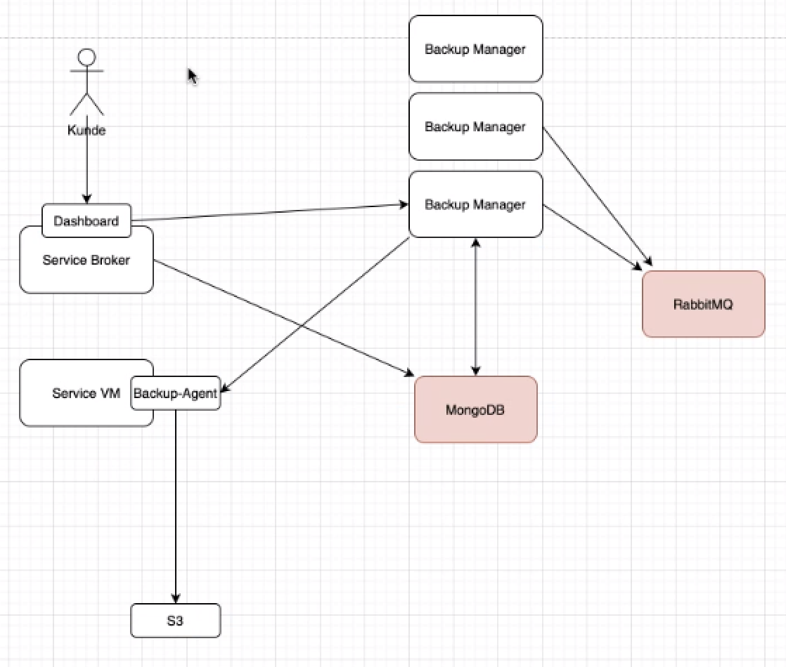
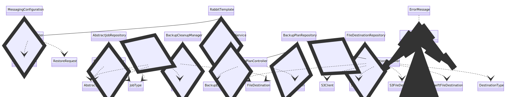

# evoila Open Service Broker Backup Manager

Author: Thomas Quandt

Last modified: 2021-04-15

## Table of contents

- [evoila Open Service Broker Backup Manager](#evoila-open-service-broker-backup-manager)
  - [Table of contents](#table-of-contents)
  - [Overview](#overview)
    - [Information Links](#information-links)
    - [evoila OSB Framework](#evoila-osb-framework)
  - [Backup Manager Documentation](#backup-manager-documentation)
    - [Swagger](#swagger)
    - [Overview](#overview-1)
      - [BackupPlans](#backupplans)
      - [Destination](#destination)
      - [Tasks](#tasks)
      - [Requests](#requests)
      - [Jobs](#jobs)
      - [Example: Creating a backup](#example-creating-a-backup)
    - [Packages](#packages)
      - [clients](#clients)
      - [config](#config)
      - [controller](#controller)
      - [queue](#queue)
      - [repository](#repository)
      - [service](#service)
        - [service.executor](#serviceexecutor)
        - [service.manager](#servicemanager)
  - [Setup (local evoila dev environment)](#setup-local-evoila-dev-environment)
    - [Repositories](#repositories)
    - [osb-local](#osb-local)
    - [osb-backup-manager](#osb-backup-manager)
      - [Github](#github)
      - [Configuration](#configuration)
      - [Troubleshooting](#troubleshooting)
    - [osb-backup-agent](#osb-backup-agent)
  - [Test with Postman](#test-with-postman)
    - [Create backup and retrieve logs](#create-backup-and-retrieve-logs)
  - [TODO](#todo)
  - [Appendix](#appendix)
    - [Mermaid class diagram Backup Manager](#mermaid-class-diagram-backup-manager)
      - [Controllers](#controllers)
      - [Service](#service-1)
      - [Repository](#repository-1)
      - [Model](#model)


----
## Overview

### Information Links

| Description | Link |
| - | - |
| osb-docs | https://github.com/evoila/osb-docs |
| Services Overview | https://docs.cloudfoundry.org/services/overview.html |
| OSB API | https://www.openservicebrokerapi.org/ |
| Open Service Broker API | https://github.com/openservicebrokerapi/servicebroker/blob/master/spec.md |
| BOSH Tutorial | https://www.youtube.com/watch?v=goSYBc0_724 |


----
### evoila OSB Framework

Overview (TODO pretty diagram)



With [evoila Open Service Broker Framework](https://github.com/evoila/osb-docs) are all osb projects described. E.g. the Backup Agent, Dashboard, Credhub, etc. are each components of the OSB Framework. Describing the diagram above (note: MongoDB and other parts might or can be replaced with other technologies):

**Service Broker**

Read [Services Overview](https://docs.cloudfoundry.org/services/overview.html) or / and [Open Service Broker API](https://www.openservicebrokerapi.org/) for a general understanding of services in CF before continuing this document. The Service Broker provides a **Dashboard** for configuring **Backup Manager**, as well as providing the API to bind applications to the **Backup-Agent**. From the Dashboard, users can configure endpoints, plans, backups, etc. Through Endpoints users can define where the backups are stored. Configurations of the Backup Managers are saved in the **MongoDB**. 

> One MongoDB will be used through multiple instances of Service Brokers and Backup Managers.


**Backup Manager**

[Backup Manager](https://github.com/evoila/osb-backup-manager) read their configurations from the **MongoDB** and are used to schedule backup jobs. **RabbitMQ** is a queue for jobs to be executed from an available Manager. It's mandatory to configure and connect a **Backup Agent** for the Backup Manager to work.


**Backup Agent**

The [Backup Agent](https://github.com/evoila/osb-backup-agent) is used to trigger scripts for saving backups from a bound application to a before configured endpoint. The scripts are defined in the bosh release of the service.


> Further reading: [evoila Open Service Broker Framework](https://github.com/evoila/osb-docs)


----
## Backup Manager Documentation

### Swagger

The route for the Swagger generated json is `/v2/api-docs`. A downloaded json can be found in the swagger folder.


### Overview

Defining some key words, since the implementation behind those could be replaced later on with another technology:
- queue: RabbitMQ (planned to be replaced with Kafka)
- repository: MongoDB

#### BackupPlans

`BackupPlan` describe for what instance backups need to be executed, how often and where the backup-files need to be stored (destinations).

`BackupPlan` are added to the **repository** through the `BackupPlanController` and `BackupPlanService`, which is executed by the Dashboard. When `BackupPlan` are modified, the `BackupPlanService` also modifies the corresponding task and scheduling of those tasks within the `BackupSchedulingService`.

#### Destination

A storage for backup-files. This can be e.g. S3 Amazon, OpenStack Swift, etc. 

#### Tasks

Tasks are created by the `BackupSchedulingService`. A Spring `ThreadPoolTaskScheduler` is used to trigger tasks periodically, scheduled with a cron string. Tasks add new backup- and restore-requests to the **queue**, so that they can be further processed as jobs later on.

#### Requests

The **queue** is for requests (`BackupRequest` and `RestoreRequest`) waiting to be further processed as jobs by the Backup Manager. Requests are usually added to the **queue** by a task scheduled in the `BackupSchedulingService`, but can also be added with the routes defined in `BackupController`.

`JobMessageListener` listens to the **queue** and creates jobs with the `BackupServiceManager` or `RestoreServiceManager`. The service managers trigger jobs and communicates with the Backup Agent through the classes in the `executor` package. The Backup Agent creates the backup files.

#### Jobs

Jobs (`BackupJob`, `RestoreJob`) represent one full execution of a single backup creation or restoration. A job contains a list of items, which can be databases or other filesystems of an service instance. Once all items have been processed (e.g. all backup files created), the job has finished.

Jobs stored in the **repository** have been sent to the Backup Agent to execute a backup. Jobs are usually added (and their `JobStatus` updated) to the **repository** by the before mentioned `BackupServiceManager` or `RestoreServiceManager`.

#### Example: Creating a backup

> This example is a simplified explanation of the general logic, not every line of code or execution is described.

The workflow for adding new `BackupPlan` is as follows:
- `BackupPlanController`
  - POST Request to add the given `BackupPlan` to the Backup Manager
- `BackupPlanService`
  - Look up if a destination was configured and exists in the **repository**
  - Save the `BackupPlan` in the **repository**
  - If the `BackupPlan` isn't paused, create a new task
- `BackupSchedulingService`
  - Create a new `BackupTask` and store it in a HashMap
  - Execute the `BackupTask` periodically as specified in the cron string.
  - The `BackupTask` adds a new `BackupRequest` to the **queue** every time it's executed

The Backup Manager also has a listener on the **queue** configured, which triggers every time a new request is added:
- `JobMessageListener`
  - Event: A new message has been added to the **queue**
  - Look up if the message is a `BackupRequest` or `RestoreRequest` and execute the request accordingly with either the `BackupServiceManager` or `RestoreServiceManager` (this example will follow a `BackupRequest`)
- `BackupServiceManager`
  - Get the `BackupPlan` and `FileDestination` described in the `BackupRequest`
  - Create a `BackupJob` (with `JobStatus.STARTED`) and add it to the **repository**
  - `CredentialService`
    - With the help of the `osb-core` module, get the credentials needed to access the instance
  - Get the applicable `BackupExecutorService`
  - Set the `JobStatus` to `RUNNING`
  - `AgentBasedBackupExecutorService`
    - Make a HTTP request to the Backup Agent, to start a backup process
  - `AgentBasedExecutorService`
    - Make a HTTP request to the Backup Agent, to check the state of the backup process
  - Set the `JobStatus` to `SUCCEEDED` or `FAILED` depending on the received `AgentBackupResponse`


### Packages

#### clients

Backup files can be downloaded or uploaded to one of the following cloud storages:
- Amazon S3
- OpenStack Swift

Classes defined in this package can interact with those storages. The Backup Manager uses those classes to validate the storage (check if backup files can be stored) and clean up old backup files.

#### config

Standard Spring configuration files. 

#### controller

Different controllers for accessing CRUD operations through the defined routes. Is used to manage backup plans, jobs, destinations, etc. 

A simple class diagram for overview purposes:



Last modified: 2021-04-14

#### queue

Classes to configure the job queue (currently implemented through RabbitMQ) and listen to new `BackupRequest` or `RestoreRequest`. If new requests are added to the queue, jobs will be created with the classes in the `service.manager` package.

#### repository

Interfaces and classes to interact with repositories. 

The interfaces extend a `MongoRepository`, which work without a direct implementation, but by writing method names like MongoDB queries. The API will then implement the methods automatically. 

Further reading on MongoDB in Spring: https://docs.spring.io/spring-data/mongodb/docs/1.2.0.RELEASE/reference/html/mongo.repositories.html

#### service

A bulk of the business logic can be found in this package. Classes in the root of the package are generally for interacting with the repositories, destination clients and scheduling tasks.

##### service.executor

Classes for interacting with the Backup Agent.

##### service.manager

Classes for executing backup- and restore-jobs with the help of the `service.executor` package and cleaning up jobs.


----
## Setup (local evoila dev environment)

### Repositories

| Repo | Link |
| - | - |
| osb-backup-manager | https://github.com/evoila/osb-backup-manager.git |
| osb-backup-agent | https://github.com/evoila/osb-backup-agent.git |
| osb-local | https://bitbucket.org/evoila-group/osb-local/src/master/ |

Download repository to start DBs used for backup and configuration.

Download all needed repositories
```
# git clone bitbucket, can't post a linke here since its different for users
git clone https://github.com/evoila/osb-backup-manager.git --recursive
git clone https://github.com/evoila/osb-backup-agent.git
```

> Pay attention to --recursive, since the osb-backup-manager has a submodule inside. Git doesn't clone submodules by default.


----
### osb-local

Start a docker compose in folder "./osb-local/". To start the containers in the background, use `docker-compose up -d` . `docker-compose down` to stop all containers.

The MinIO front-end can be opened at localhost:9000. (Defined in docker-compose.yml)

User: `minioadmin`
Password: `minioadmin`


----
### osb-backup-manager

Make sure that you have completed the steps in [osb-local](#osb-local) first.


#### Github

Make sure that you cloned the repository with `--recursive`. If not, clone the missing submodules by executing `git submodule update --init`.

If maven dependency issues pop up, try changing the branch of the submodule. This can be done with the file ".gitmodules". Add the line `branch = BRANCH_NAME` with a working branch.


#### Configuration

| Description | Links |
| - | - |
| CF HOB Lab | https://evoilade.sharepoint.com/sites/wiki/knowledge/Seiten/HOB%20LAB/CF%20HOB%20Lab.aspx |
| Repo with configurations | https://bitbucket.org/evoila-group/hob-cf-service-broker-configuration/src/master/ |

Follow the steps as descriped in chapter "Vorbereitung" in the CF HOB Lab sharepoint page.

1. Download hob.cer
2. Execute the following commands:
```
sudo security add-trusted-cert -d -r trustRoot -k /Library/Keychains/System.keychain hob.cer
$JAVA_HOME/bin/keytool -storepass changeit -importcert -noprompt -file hob.cer -cacerts -alias evoilaMCA
```

> The current version also runs on Java 11 (2021-03-17), you **might** need to update your `$JAVA_HOME` path.


Set the following environment variables afterwards (replace username and password):

```
export SPRING_CLOUD_CONFIG_URI=http://config-server-test.system.cf.hob.local
export SPRING_CLOUD_CONFIG_USERNAME=<username>
export SPRING_CLOUD_CONFIG_PASSWORD=<password>
export SPRING_APPLICATION_NAME=local
export SPRING_PROFILES_ACTIVE=backend,backup-manager,oauth2
```

> The config server is fetching the configurations from credhub and bitbucket repository. You need to be connected to HOB through VPN.

> Some additional CF configurations might be required on the config server.


**Some additional information:**

Configurations can be downloaded and viewed through the following commands.
```
credhub login -s osb-test.bosh.hob.local:8844 --sso
credhub export -p /osb-evoila-test -f /tmp/c.yml
credhub export -p /local -f /tmp/c.yml
```

To access the routes you need a bearer token. Through evoila you can get the token with the following commands:

```
cf login -a https://api.system.cf.hob.local --sso --skip-ssl-validation
cf oauth-token
```

> The oauth token expires very fast, so you need to fetch them frequently.

If you are using Postman, you need to use the token through the "Authorization" tab, by selecting `Bearer Token` and pasting the token without `bearer` into the form field.


#### Troubleshooting

In case this error message prevents the Backup-Manager from being executed: `java: exporting a package from system module java.base is not allowed with --release`

Intellij: Go to Preferences -> Build, Execution, Deployment -> Compiler -> Java Compiler. Uncheck the "User '--release' optiion for cross-compilation (Java 9 and later)".


----
### osb-backup-agent

Put this bash script in the root of osb-backup-agent repo (author: Marius Berger):
```bash
#!/bin/bash
echo "Trying to build the application ..."
go build
if [ $? -gt 0 ]; then
    echo ""
    echo "Building the app failed. Aborting the execution ..."
    exit 1
fi

export client_username="admin"
export client_password="bosh"
export client_port="8000"
export directory_backup="local_dev_folder/testBackups"
export directory_restore="local_dev_folder/testRestores"
export scripts_path="local_dev_folder/testscripts"
export allowed_to_delete_files="true"
export max_job_number="1"
export skip_storage="false"
#export default_s3_endpoint="localhost:9000"

./osb-backup-agent

exit 0
```

Normally extra files are downloaded via S3 (note: this information might be false). For local development user unzip local_dev_folder.zip. **Check in files if stuff like paths needs to be adjusted!**


----
## Test with Postman

Make sure to create the bucker "backup-agent-test" in the MinIO front-end first. See [osb-local](#osb-local).


### Create backup and retrieve logs

Create backup: `POST localhost:8000/backup`

Authorization needs to be set to "Basic Auth" and `admin` / `bosh`. (Defined as env variables in script from [osb-backup-agent](#osb-backup-agent))

```json
{
    "id" : "id-1234567890",
    "compression" : true,
    "encryption_key" : "1234",
    "destination" : {
        "type": "S3",
        "skipStorage" : false,
        "bucket": "backup-agent-test",
        "region": "eu-central-1",
        "endpoint" : "http://localhost:9000",
        "authKey": "minioadmin",
        "authSecret": "minioadmin",
        "skipSSL": true
    },
    "backup" : {
        "host": "host123",
        "username": "bla1",
        "password": "bla2",
        "database": "testDB",
        "parameters": [
            { "key": "arbitraryValue" },
            { "additional": "value" },
            { "numbers": 1 }
        ]
    }
}
```

To retrieve logs for a backup: `GET localhost:8000/backup/id-1234567890`


----
## TODO

> This section contains notes which need to find a place in the docs. Everything here is temporary.

Restore backup POST ?

```json
{
    "id" : "id-1234567890",
    "compression" : true,
    "encryption_key" : "1234",
    "destination" : {
        "type": "S3",
        "skipStorage" : false,
        "bucket": "backup-agent-test",
        "region": "eu-central-1",
        "endpoint" : "http://127.0.0.1:9000",
        "authKey": "minioadmin",
        "authSecret": "minioadmin",
        "skipSSL" : true,
        "filename": "2021_03_15_09_56_host123_testDB.txt"
    },
    "restore" : {
        "host": "host123",
        "username": "bla1",
        "password": "bla2",
        "database": "testDB",
        "parameters": [
            { "key": "arbitraryValue" },
            { "additional": "value" },
            { "numbers": 1 }
        ]
    }
}
```

## Appendix

### Mermaid class diagram Backup Manager
https://mermaid-js.github.io/mermaid-live-editor

```
--|> Inheritance
..> Dependency
--o Aggregation
```

#### Controllers

class-diagram-backup-manager-controller
```
classDiagram

%% BackupController
RabbitTemplate o-- BackupController
MessagingConfiguration o-- BackupController
BackupController ..> BackupRequest
BackupController ..> RestoreRequest

%% RestoreJobController
AbstractJobRepository o-- RestoreJobController
RestoreJobController ..> AbstractJob
RestoreJobController ..> JobType

%% BackupJobController
BackupCleanupManager o-- BackupJobController
AbstractJobRepository o-- BackupJobController
BackupJobController ..> AbstractJob
BackupJobController ..> FileDestination
BackupJobController ..> JobStatus
BackupJobController ..> JobType

%% BackupPlanController
BackupPlanRepository o-- BackupPlanController
BackupPlanService o-- BackupPlanController
BackupPlanController ..> BackupException
BackupPlanController ..> BackupPlan

%% DestinationController
BaseController <|-- DestinationController
FileDestinationRepository o-- DestinationController
BackupPlanRepository o-- DestinationController
DestinationController ..> S3Client
DestinationController ..> SwiftClient
DestinationController ..> FileDestination
DestinationController ..> S3FileDestination
DestinationController ..> SwiftFileDestination
DestinationController ..> DestinationType

%% BaseController
ErrorMessage <.. BaseController
<<abstract>> BaseController
```

#### Service

BackupPlanService and everything that connects to it (starting point is the BackupPlanController). The class diagram doesn't provide a complete picture of every dependency used, but is meant as an overview of the important components and how they interconnect.
```
classDiagram

%% BackupPlanController
BackupPlanRepository o-- BackupPlanController
BackupPlanService o-- BackupPlanController
BackupPlanController ..> BackupException
BackupPlanController ..> BackupPlan

%% BackupPlanService
BackupPlanRepository o-- BackupPlanService
BackupSchedulingService o-- BackupPlanService
FileDestinationRepository o-- BackupPlanService
BackupPlanService --o BackupServiceManager
BackupPlanService ..> BackupPlan

%% BackupPlanRepository
MongoRepository <|-- BackupPlanRepository

%% BackupSchedulingService
BackupPlanRepository o-- BackupSchedulingService
MessagingConfiguration o-- BackupSchedulingService
RabbitTemplate o-- BackupSchedulingService
ThreadPoolTaskScheduler o-- BackupSchedulingService
BackupSchedulingService ..> BackupException
BackupSchedulingService ..> BackupPlan
BackupSchedulingService ..> BackupRequest

%% FileDestinationRepository
MongoRepository <|-- FileDestinationRepository

%% BackupServiceManager
AbstractServiceManager <|-- BackupServiceManager
BackupCleanupManager o-- BackupServiceManager

%% BackupServiceManager
AbstractServiceManager <|-- BackupServiceManager
BackupCleanupManager o-- BackupServiceManager
BackupServiceManager ..> BackupException
BackupServiceManager ..> CredentialService
BackupServiceManager ..> BackupRequestException
BackupServiceManager ..> BackupExecutorService
BackupServiceManager ..> AgentBackupResponse
BackupServiceManager ..> AbstractJob
BackupServiceManager ..> BackupJob
BackupServiceManager ..> BackupPlan
BackupServiceManager ..> EndpointCredential
BackupServiceManager ..> FileDestination
BackupServiceManager ..> BackupRequest
BackupServiceManager ..> JobStatus
BackupServiceManager ..> JobType
```

#### Repository

```
classDiagram

%% AbstractJobRepository
MongoRepository <|-- AbstractJobRepository
AbstractJobRepository ..> AbstractJob
AbstractJobRepository ..> FileDestination
AbstractJobRepository ..> BackupPlan
AbstractJobRepository ..> JobStatus
AbstractJobRepository ..> JobType
```

#### Model

```
classDiagram

%% osb-backup-model -------------------------

MongoRepository <|-- AbstractJobRepository
AbstractJobRepository ..> AbstractJob
AbstractJobRepository ..> FileDestination
AbstractJobRepository ..> BackupPlan
AbstractJobRepository ..> JobStatus
AbstractJobRepository ..> JobType
```
